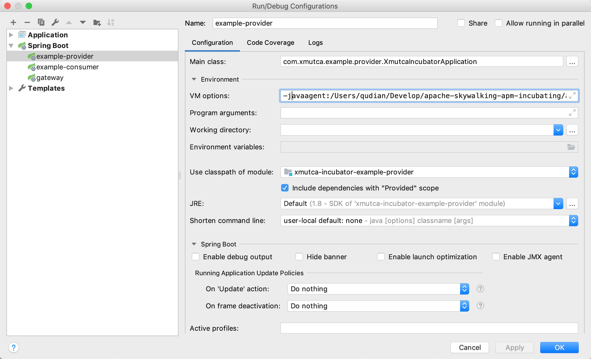

# 一. 系统启动
- 可以使用本项目的docker进行启动
- 参考：https://github.com/apache/incubator-skywalking
- 参考：https://github.com/JaredTan95/skywalking-docker

# 二. 使用方法
1. 下载于版本相对应的agent

下载地址：https://www.apache.org/dyn/closer.cgi/incubator/skywalking/6.3.0/apache-skywalking-apm-incubating-6.3.0.tar.gz

2. 解压文件

3. 基本配置
https://github.com/apache/incubator-skywalking/blob/master/docs/en/setup/service-agent/java-agent/README.md

4. 使用方法

##### 在IDEA等IDE中使用

```
-javaagent:/Users/qudian/Develop/apache-skywalking-apm-incubating/agent/skywalking-agent.jar -Dskywalking.agent.service_name=example-provdier

```

##### 直接使用

```
java -javaagent:/Users/qudian/Develop/apache-skywalking-apm-incubating/agent/skywalking-agent.jar -Dskywalking.agent.service_name=example-provdier -jar example-provider.jar
```

