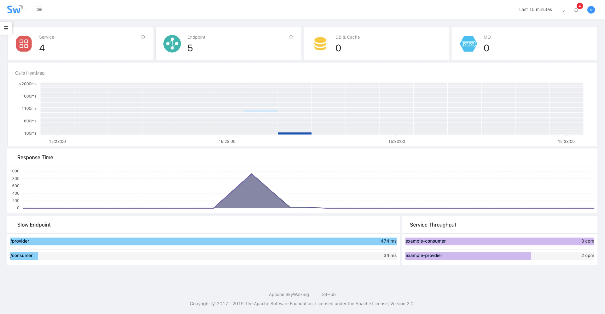

# 1. 启动系统
docker-compose up -d

# 2. 设置时区
系统运行成功以后，需要到每一个服务中设置时区，否则项目无法正常使用。

设置方法：
- apk update 
- apk add curl bash tree tzdata 
- cp -r -f /usr/share/zoneinfo/Asia/Shanghai /etc/localtime

# 3. 系统访问
地址：http://localhost:8080

